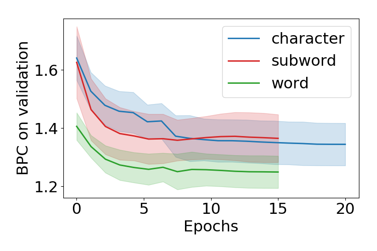
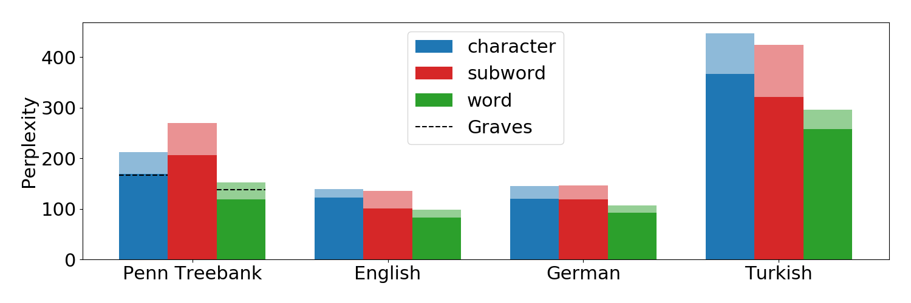

# Comparing language models based on words, subwords and characters in different languages

Collaborators: @[pascalesser](https://github.com/pascalesser) and @[basakeskili](https://github.com/basakeskili)

## Abstract
We compare recurrent neural networks for language modeling based on word-, subword- and character-level inputs. We employ a simple architecture consisting of 1,000 LSTM units on four different datasets, first the Penn Treebank and then the Harry Potter books in English, German and Turkish. Word-models have been shown to outperform character-based models in English. Nonetheless, we assumed that their advantage might not apply to languages with a richer morphology. However, our results disproved this assumption. Overall, the word-based model outperformed both the character- and subword-based model on all datasets, indicating that their relative performance does not depend on the characteristics of the language they are applied to but the characteristics of the model.

The full report is given as a pdf-file.

## Training

Code and instructions relevant for the training of the model can be found in `char_lstm` directory.



Bits-per-character (BPC) averages and standard deviations during training for the character-, subword- and word-based models on the four datasets.


## Results



Perplexities for the character-, subword- and word-based models (in blue, red and green) for the four tested datasets Penn Treebank and the English, German and Turkish Harry Potter. Solid bars represent the performance when dynamic evaluation is applied, the shaded areas depict the perplexities obtained when keeping the weights fixed during testing. The results of [Graves](https://arxiv.org/abs/1308.0850) are shown as dashed lines.


## Generated Text

```
he turned back to himself . 

right , he said , looking up at fudge 's face . 

i m staying here harry muttered to ron . 

when she shook her head again . 

sleep , dudley was in the library , harry 's thoughts would not be revealed in grimmauld place . 

harry got himself , but before somebody open external 's eye , does that malfoy or thinner like him as it did , as the elf 's stone set ever mended with <unk> toffee cloaks . 

have a good time , harry . 

only they could move through the canopy doors . 

what 's that seeing a job like he did subsided i was wearing a dog deemed . 

snape came striding into the room into night .  
```
